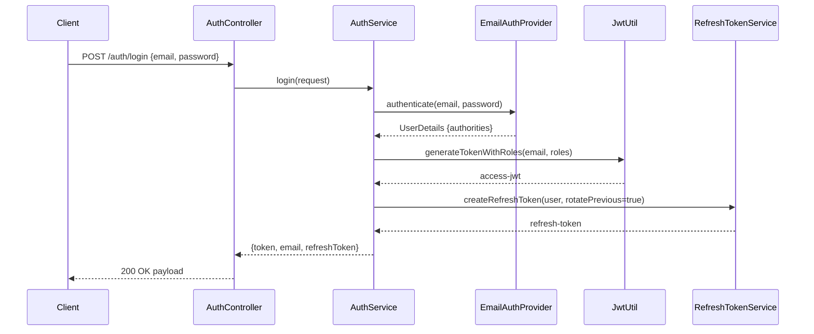
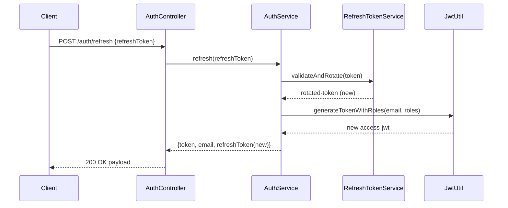

## JWT Authentication and Refresh Flows

This document explains how JWT-based authentication works in this service, including access token issuance, request authentication, refresh token rotation, revocation, and configuration knobs.

### Components

- Access token (JWT): short-lived, signed with HS256.
  - Subject: user email.
  - Claim: `roles` (array of role strings like USER, MANAGER).
  - TTL: `jwt.expiration` (ms).
  - Issued by: `JwtUtil.generateTokenWithRoles(email, roles)`.
- Refresh token (opaque): long-lived, stored in DB.
  - Table: `refresh_token` with columns: `id`, `token`, `user_id`, `expires_at`, `revoked`, `replaced_by_token`, timestamps.
  - TTL: `jwt.refresh.expiration` (ms).
  - Managed by: `RefreshTokenService`.

### Endpoints

- POST `/auth/login`
  - Body: `{ "email": "...", "password": "..." }`
  - Response: `{ token, email, refreshToken }`
  - Behavior:
    1. Validate credentials via `EmailBasedAuthenticationProvider`.
    2. Resolve authorities: always USER; add MANAGER if applicable.
    3. Issue access JWT with `roles` claim.
    4. Create refresh token; previous refresh tokens for the user are revoked/removed.

- POST `/auth/refresh`
  - Body: `{ "refreshToken": "<opaque-uuid>" }`
  - Response: `{ token, email, refreshToken }` (rotated refresh token)
  - Behavior:
    1. Look up presented refresh token; 404 if not found.
    2. Reject if revoked or expired (400).
    3. Mark current refresh token as revoked; create new one and set `replaced_by_token`.
    4. Recompute roles and issue a new access JWT.

### Request Authentication Flow (runtime)

1. Client calls protected endpoint with `Authorization: Bearer <access-jwt>`.
2. `JwtAuthorizationFilter` extracts and validates the JWT (signature + exp).
3. Extracts `email` and `roles` claims and sets `UsernamePasswordAuthenticationToken` in `SecurityContext` with `ROLE_`-prefixed authorities.
4. If token is invalid/expired/missing, Security will proceed unauthenticated; protected endpoints will return 401/403 per config.

### Token Claims

- JWT header: `{ "alg": "HS256", "typ": "JWT" }`
- JWT payload example:

```json
{
  "sub": "john.doe@example.com",
  "roles": ["USER", "MANAGER"],
  "iat": 1736420000,
  "exp": 1736423600
}
```

Notes:
- `JwtUtil.getRolesFromToken` reads `roles` (array). For backward-compatibility, it also supports a single `role` claim if present.

### Rotation and Revocation Policy

- On login, all previous refresh tokens for the user are revoked/removed (single-active-token policy) to reduce blast radius on theft.
- On refresh, the presented token is revoked and replaced with a newly issued token (one-time use).
- Revocation states:
  - `revoked = true` and `replaced_by_token` set on the previous record.
  - Expiration enforced with `expires_at`.

### Error Semantics

- Expired/invalid access token: request is unauthenticated; protected endpoints return 401.
- Refresh with unknown token: 404.
- Refresh with expired or revoked token: 400.
- Login with bad credentials: 401.

### Configuration

Application settings (ms):

```yaml
jwt:
  secret: <HS256 secret>
  expiration: 900000          # e.g., 15m access token
  refresh:
    expiration: 1209600000    # e.g., 14d refresh token
```

Defaults in repo:
- `src/main/resources/application.yml`: prod/dev defaults
- `src/test/resources/application-test.yml`: test-specific TTLs

### Security Filter Chain

- Stateless sessions; JWT filter registered before `UsernamePasswordAuthenticationFilter`.
- `/auth/**` and `/h2-console/**` are permitted; other routes require authentication/roles as configured in `SecurityConfig`.

### Example Exchanges

Login:

```http
POST /api/auth/login
Content-Type: application/json

{ "email": "john.doe@example.com", "password": "Password123" }
```

Response:

```json
{
  "success": true,
  "data": {
    "token": "<access-jwt>",
    "email": "john.doe@example.com",
    "refreshToken": "<opaque-uuid>"
  }
}
```

Using access token:

```http
GET /api/users/me
Authorization: Bearer <access-jwt>
```

Refreshing:

```http
POST /api/auth/refresh
Content-Type: application/json

{ "refreshToken": "<opaque-uuid>" }
```

Response (rotated):

```json
{
  "success": true,
  "data": {
    "token": "<new-access-jwt>",
    "email": "john.doe@example.com",
    "refreshToken": "<new-opaque-uuid>"
  }
}
```

### Sequence Diagrams

Login issuance:



Refresh flow:



### Security Recommendations (operational)

- Prefer storing the refresh token in an HttpOnly, Secure cookie scoped to `/auth/refresh` to reduce XSS exposure.
- Keep access token TTL short (e.g., 5–15 minutes); keep refresh TTL reasonable (e.g., 7–30 days).
- Revoke all refresh tokens on password change or account compromise.
- Monitor refresh attempts and throttle to mitigate brute force on stolen tokens.
- Rotate signing secrets carefully; consider key identifiers (kid) when moving beyond HS256.

### Relevant Classes (overview)

- `JwtUtil`: token creation, validation, claim extraction.
- `JwtAuthorizationFilter`: request-time JWT validation and authentication context setup.
- `AuthServiceImpl`: login issuance and refresh flow orchestration.
- `RefreshTokenService(Impl)`: DB persistence, validation, rotation of refresh tokens.
- `EmailAuthenticationService` and `EmailBasedAuthenticationProvider`: credential verification and authority resolution.


